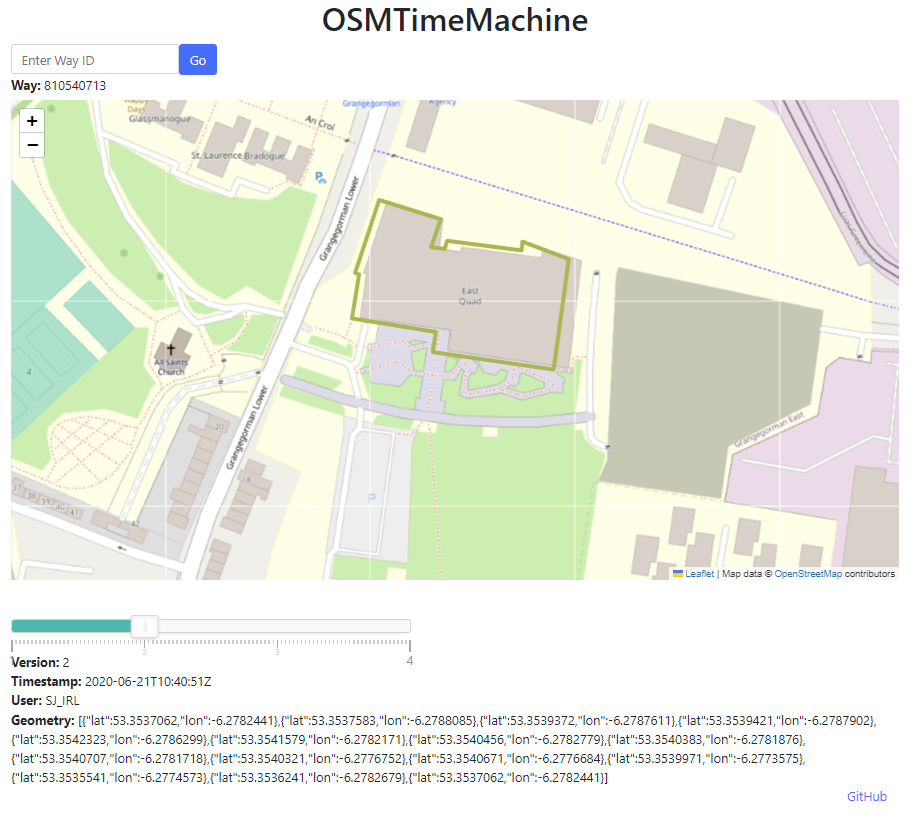

# OSMTimeMachine

OSMTimeMachine is a web application that allows you to explore the historical changes of OpenStreetMap (OSM) way data using a time-slider interface.

## Features

- View the historical versions of a selected OpenStreetMap way.
- Navigate through different versions using the interactive time-slider.
- Visualize the changes in the way geometry on an interactive map.

## Getting Started

### Prerequisites
- Flask (Python framework)

### Contributing

Contributions are welcome! If you encounter any issues or have suggestions for improvements, please feel free to open an issue or submit a pull request.

### License

This project is licensed under the [AGPL-3](LICENSE).

### Acknowledgements

- This project was inspired by the concept of time sliders in mapping applications.
- Special thanks to the OpenStreetMap community for providing the data.

### Screenshots

## Contact

For questions or inquiries, please contact DeepMapper2023@googlemail.com

