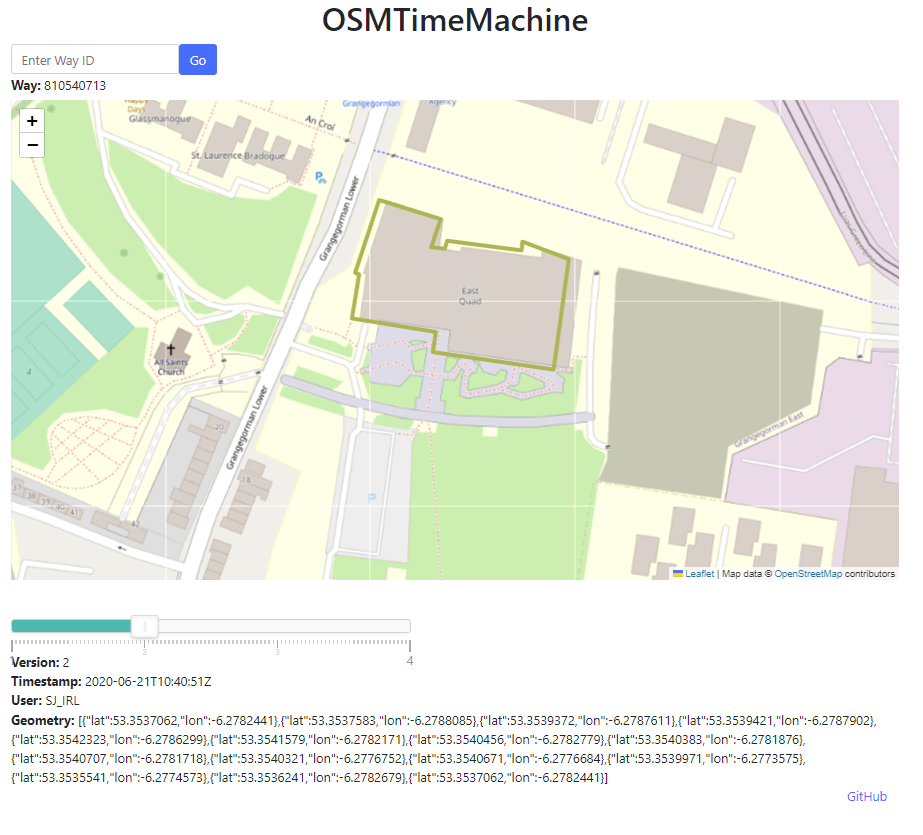

# OSMTimeMachine

OSMTimeMachine is a web application that allows you to explore the historical changes of OpenStreetMap (OSM) way data using a time-slider interface.

## 🌟 Features

- View the historical versions of a selected OpenStreetMap way
- Navigate through different versions using the interactive time-slider
- Visualize the changes in the way geometry on an interactive map
- Modern glassmorphism UI with dark mode
- Fully responsive design for all devices
- Comprehensive error handling and validation

## 🚀 Live Demo

Visit: [https://lasith-niro.github.io/osmtimemachine](https://lasith-niro.github.io/osmtimemachine)

## 📦 Deployment Options


### Option 1: Local Flask Server (Dynamic)

For local development or private deployment:

#### Prerequisites
- Python 3.7+
- Flask

#### Installation

```bash
# Install dependencies
pip install -r requirements.txt

# Run the Flask server
python app.py
```

Visit `http://localhost:5002` in your browser.

## 🎯 How to Use

1. Enter a valid OpenStreetMap way ID (e.g., `5013364`)
2. Click "Explore History"
3. Use the timeline slider to navigate through different versions
4. View version details including timestamp, editor, and tags

### Finding Way IDs

1. Go to [OpenStreetMap.org](https://www.openstreetmap.org)
2. Search for a location
3. Click on a building, road, or area
4. Look for "way/" in the URL - the number after it is the way ID

## 🛠️ Technology Stack

- **Frontend:** HTML5, CSS3, JavaScript (Vanilla)
- **Map:** Leaflet.js
- **Slider:** noUiSlider
- **API:** Overpass API (OpenStreetMap)
- **Backend (Optional):** Flask (Python)

## 📱 Browser Compatibility

- ✅ Chrome/Edge (latest)
- ✅ Firefox (latest)
- ✅ Safari (latest)
- ✅ Mobile browsers

## 🤝 Contributing

Contributions are welcome! If you encounter any issues or have suggestions for improvements, please feel free to open an issue or submit a pull request.

## 📄 License

This project is licensed under the [AGPL-3.0](LICENSE).

## 🙏 Acknowledgements

- This project was inspired by the concept of time sliders in mapping applications
- Special thanks to the OpenStreetMap community for providing the data
- Map data © [OpenStreetMap](https://www.openstreetmap.org/) contributors

## 📸 Screenshots



## 📧 Contact

For questions or inquiries, please contact DeepMapper2023@googlemail.com

---

Made with 💜 by [Lasith-Niro](https://github.com/Lasith-Niro)
